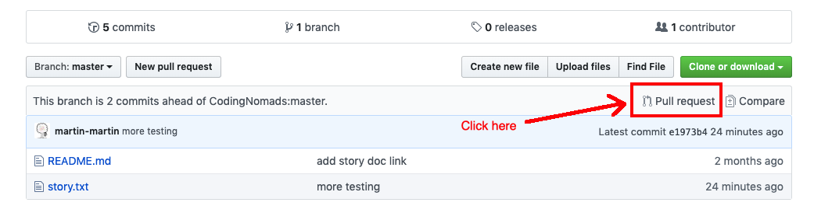

# Building a story together

Using the concepts we learned about version control and GitHub, add one sentence to continue the collaborative story in [story.txt](story.txt).

## An example

Let's assume the previous last sentence of the story is:

>After walking for hours through the dark woods, Carol suddenly encountered an open, sunlit patch of grass.

You could add something like:

>At first she thought she saw a unicorn standing there, but approaching closer she realized it was ...

You don't need to finish your sentence, but you may. You can leave it open for the next person to top it off with their own ideas,
or throw them some facts and see how they'll take it from there.

## Some notes

* Keep it concise. Finish a sentence and start a new one, or stick with one sentence. The story should be written collaboratively by many people to a similar extend.
* Keep it clean! You should be able to read the story to your kids without additional censorship.
* Have fun! :)

---

## How to complete this project

By completing this project you'll go through the whole GitHub process that you also use for contributing to any Open Source project. You'll do this to get practice with that _process_.

1. Fork the repo on GitHub
2. Clone to your local machine using `git clone` and the URL from your fork of the project
3. Add your sentence to the story
4. Push it back up to your personal GitHub
5. Create a _Pull Request_ (PR) from your fork

By creating the PR, you are asking CodingNomads to merge your addition into the repository hosted on CodingNomads' GitHub.
